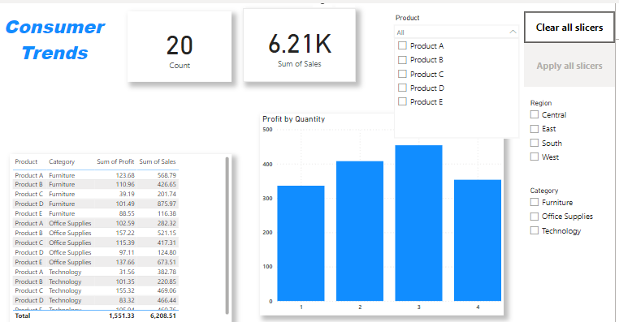

# Consumer Trends of A Superstore

This dashboard provides insights into the consumer trends of a superstore, focusing on product sales, profit, and regional distribution. The visualizations and slicers allow users to explore data interactively.

## Features

### 1. **Key Metrics**

- **Count**: Displays the total number of records or transactions.
- **Sum of Sales**: Shows the total sales amount, providing a quick overview of revenue.

### 2. **Profit by Quantity Chart**

- A bar chart visualizing profit based on quantity sold, segmented into four categories.

### 3. **Data Table**

- A detailed table displaying:
  - Product Name
  - Category
  - Sum of Profit
  - Sum of Sales

### 4. **Interactive Slicers**

- **Product Slicer**: Filter data by specific products (e.g., Product A, Product B, etc.).
- **Region Slicer**: Filter data by geographical regions (e.g., Central, East, South, West).
- **Category Slicer**: Filter data by product categories (e.g., Furniture, Office Supplies, Technology).

### 5. **Clear All Slicers**

- A button to reset all slicers and display the complete dataset.

## How to Use

1. **Select Filters**: Use the slicers to filter the data by product, region, or category.
2. **Analyze Metrics**: Observe the key metrics and the impact of filters on the data.
3. **Interpret the Chart**: Use the "Profit by Quantity" chart to understand profitability trends.
4. **Reset Filters**: Click "Clear All Slicers" to reset all filters and return to the default view.

## Purpose

This dashboard aims to help users:

- Identify top-performing products.
- Analyze sales and profit trends.
- Explore regional performance.

---

### Notes

- Ensure that the required dataset is connected for the dashboard to function correctly.
- The slicers allow for dynamic exploration of data to answer specific business questions.

---

Feel free to modify this dashboard to suit your specific business needs!
